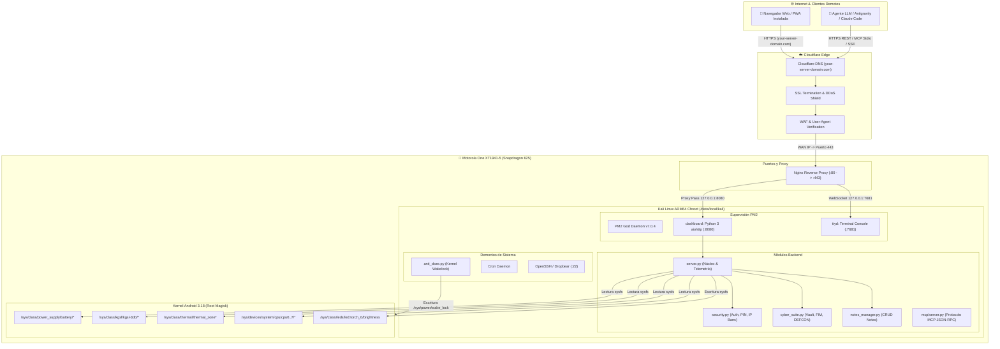

# 📱 Android-MicroServer: Autonomous ARM64 Linux Micro-Server & AI Appliance

<p align="center">
  
</p>

<p align="center">
  <strong>Transform any Android smartphone into an ultra-low-power, 24/7 personal cloud server, hardware telemetry station, and self-hosted AI development environment.</strong>
</p>

<p align="center">
  
  
  
  
  
  
  
  
  
  <a href="llms.txt"></a>
</p>

> 🌐 **Idioma:** Español | [Read this documentation in English](README.md)

---

## 📑 Tabla de Contenidos

- [1. Visión y Filosofía del Proyecto](#1-visión-y-filosofía-del-proyecto)
- [2. Características Principales](#2-características-principales)
- [3. Arquitectura del Sistema](#3-arquitectura-del-sistema)
  - [3.1 Topología Completa](#31-topología-completa)
  - [3.2 Especificaciones de Hardware (Motorola One XT1941-5)](#32-especificaciones-de-hardware-motorola-one-xt1941-5)
- [4. Estructura del Repositorio](#4-estructura-del-repositorio)
- [5. Guía de Instalación y Puesta en Marcha (Paso a Paso)](#5-guía-de-instalación-y-puesta-en-marcha-paso-a-paso)
  - [Paso 1: Preparación de Android y Root](#paso-1-preparación-de-android-y-root)
  - [Paso 2: Despliegue del Chroot de Kali Linux](#paso-2-despliegue-del-chroot-de-kali-linux)
  - [Paso 3: Instalación de Dependencias del Sistema](#paso-3-instalación-de-dependencias-del-sistema)
  - [Paso 4: Instalación del Backend y Servicios](#paso-4-instalación-del-backend-y-servicios)
  - [Paso 5: Configuración de Nginx y Cloudflare SSL](#paso-5-configuración-de-nginx-y-cloudflare-ssl)
  - [Paso 6: Configuración del Supervisor PM2](#paso-6-configuración-del-supervisor-pm2)
  - [Paso 7: Uptime 24/7 y Anti-Doze Wakelock](#paso-7-uptime-247-y-anti-doze-wakelock)
- [6. Módulos del Backend (`server/`)](#6-módulos-del-backend-server)
- [7. Aplicaciones Frontend y PWAs (`server/static/`)](#7-aplicaciones-frontend-y-pwas-serverstatic)
  - [7.1 El Agente de IA con Diseño Claude Desktop](#71-el-agente-de-ia-con-diseño-claude-desktop)
  - [7.2 Dashboard de Telemetría de Hardware](#72-dashboard-de-telemetría-de-hardware)
- [8. Catálogo Exhaustivo de la API REST](#8-catálogo-exhaustivo-de-la-api-rest)
- [9. Servidor MCP: Agente Autónomo de Desarrollo (`mcp/`)](#9-servidor-mcp-agente-autónomo-de-desarrollo-mcp)
  - [9.1 Las 8 Herramientas MCP Especializadas](#91-las-8-herramientas-mcp-especializadas)
  - [9.2 Flujo de Despliegue Seguro con Auto-Rollback](#92-flujo-de-despliegue-seguro-con-auto-rollback)
  - [9.3 Configuración en Antigravity / Claude Code / Cursor](#93-configuración-en-antigravity--claude-code--cursor)
- [10. Puente Cliente sin Cables (`client/remote_bridge.py`)](#10-puente-cliente-sin-cables-clientremote_bridgepy)
- [11. Skill Especializada de Antigravity (`skills/`)](#11-skill-especializada-de-antigravity-skills)
- [12. Optimización, Térmicas y Salud de la Batería](#12-optimización-térmicas-y-salud-de-la-batería)
- [13. Adaptación a Otros Dispositivos Android](#13-adaptación-a-otros-dispositivos-android)
- [14. Preguntas Frecuentes, Comparativa con Raspberry Pi y Casos de Uso (FAQ)](#14-preguntas-frecuentes-comparativa-con-raspberry-pi-y-casos-de-uso-faq)
- [15. Licencia y Créditos](#15-licencia-y-créditos)

---

## 1. Visión y Filosofía del Proyecto

Millones de smartphones funcionales terminan en cajones o vertederos cada año cuando dejan de recibir actualizaciones o su pantalla se deteriora. Sin embargo, un teléfono inteligente de gama media contiene hardware extraordinario:
- Un procesador **ARM64 multinúcleo** extremadamente eficiente.
- Memoria RAM LPDDR de bajo consumo.
- Módems Wi-Fi dual-band y Bluetooth integrados.
- **Una batería integrada que funciona como SAI/UPS natural**, protegiendo el sistema de cualquier apagón eléctrico sin apagar el servidor.
- Decenas de sensores de temperatura, voltaje, corriente y hardware accesible vía Linux sysfs.

**MotoServer** aprovecha este potencial al máximo: convierte un **Motorola One (XT1941-5)** en un servidor doméstico de alta fidelidad, con un consumo inferior a **5W**, completamente accesible desde Internet con dominio propio y SSL estricto, dotado de un agente de desarrollo con IA gobernado mediante el protocolo abierto **Model Context Protocol (MCP)**.


---

## 2. Características Principales

- ⚡ **Consumo Ultra Bajo (< 5 Watts):** Menor consumo que una bombilla LED estándar; ideal para estar encendido 24/7/365 sin impacto en la factura eléctrica.
- 🔋 **SAI / UPS Integrado:** La batería de 3000 mAh mantiene el servidor en línea ante cortes de energía durante más de 6 a 8 horas continuas.
- 🤖 **Agente de IA Integrado (PWA Claude Desktop):** Interfaz conversacional progresiva instalable en cualquier dispositivo, con streaming de respuestas SSE, historial con extracción inteligente de títulos y borrado individual de conversaciones.
- 📊 **Telemetría Profunda de Hardware:** Inspección por segundo de núcleos Qualcomm Snapdragon (8 núcleos Cortex-A53), GPU Adreno 506, sensores de batería (mA, mV, temperatura, capacidad) y zonas térmicas.
- 🛡️ **Suite de Ciberseguridad y Bóveda Cifrada:**
  - Bóveda de credenciales (`vault_data`).
  - File Integrity Monitoring (FIM) con baseline SHA-256.
  - Threat Hunter y bloqueo de IPs por fuerza bruta.
  - Modos DEFCON ajustables.
- 📝 **Gestor de Notas en Markdown:** Almacenamiento rápido en JSON con soporte de etiquetas, búsqueda y sincronización sin conexión.
- 💻 **Consola Terminal Web (`ttyd`):** Acceso a terminal bash en el navegador protegido por proxy inverso.
- 🔌 **Servidor MCP de Desarrollo Autónomo:** Permite que un asistente de IA (Claude, Antigravity, Cursor) inspeccione la arquitectura, lea código y **aplique parches con reinicio automático de PM2** y tolerancia a fallos.
- 🚫 **Cero Dependencia de Cables o ADB:** Una vez instalado, el desarrollo, monitoreo y mantenimiento se realizan 100% de manera remota inalámbrica.

---

## 3. Arquitectura del Sistema

### 3.1 Topología Completa



### 3.2 Especificaciones de Hardware (Motorola One XT1941-5)

| Componente | Especificación Técnica | Acceso / Driver en Linux |
| :--- | :--- | :--- |
| **Dispositivo / Modelo** | **Motorola One (XT1941-5)** (Codename: `deen`) | Base Android One + Kali Linux aarch64 chroot |
| **SoC** | Qualcomm Snapdragon 625 (MSM8953) | Arquitectura ARM64 v8-A |
| **CPU** | 8x ARM Cortex-A53 @ 2.016 GHz | `/sys/devices/system/cpu/cpu[0-7]/` |
| **GPU** | Qualcomm Adreno 506 @ 650 MHz | `/sys/class/kgsl/kgsl-3d0/` |
| **Memoria RAM** | 4 GB LPDDR3 (3570 MB visibles) | `/proc/meminfo` |
| **Swap / zRAM** | 2048 MB swapfile / zRAM comprimido | `/proc/swaps` |
| **Almacenamiento** | 64 GB eMMC 5.1 + MicroSD (51.3 GB montados) | `/data`, `/sdcard` |
| **Batería** | 3000 mAh Li-ion (UPS natural) | `/sys/class/power_supply/battery/` |
| **Sensores Térmicos**| Sensores independientes para CPU, PMIC y chasis | `/sys/class/thermal/thermal_zone*/` |
| **Linterna Física** | LED Flash de cámara de alta potencia | `/sys/class/leds/led:torch_0/brightness` |
| **Conectividad** | Wi-Fi 802.11 a/b/g/n (2.4 & 5 GHz) + Bluetooth 4.2 | Interfaz `wlan0` |

---

## 4. Estructura del Repositorio

```text
motoserver/
├── server/                     # Código del servidor (sincronizado desde /root/dashboard)
│   ├── server.py               # Núcleo aiohttp, enrutador, telemetría y SSE agent bridge
│   ├── security.py             # Capa de autenticación, sesiones HTTP-only, PIN y firewall de IPs
│   ├── cyber_suite.py          # Bóveda cifrada, monitor FIM y modos de seguridad DEFCON
│   ├── notes_manager.py        # Gestor de notas en JSON con tags y markdown
│   ├── anti_doze.py            # Guardián de wakelock para impedir la suspensión de Android
│   ├── keep_alive.sh           # Watchdog de emergencia
│   ├── gdrive_uploader.py      # Módulo de exportación y respaldo a Google Drive
│   └── static/                 # Frontends web estáticos y Progressive Web Apps (PWAs)
│       ├── agent.html          # PWA estilo Claude Desktop para el Agente Antigravity
│       ├── agent-manifest.json # Manifiesto para instalación standalone del Agente
│       ├── agent-sw.js         # Service Worker para ciclo de vida de la PWA del Agente
│       ├── index.html          # Dashboard de cabina de control con medidores en vivo
│       └── ...                 # Íconos SVG/PNG, CSS y dependencias vendors
│
├── client/                     # Utilidades para controlar MotoServer desde cualquier PC
│   ├── remote_bridge.py        # CLI todo-en-uno: stats, comandos remotos, lectura de archivos
│   └── sync_backup.py          # Script de sincronización LAN bidireccional por streaming tar.gz
│
├── mcp/                        # Servidor MCP "motoserver-dev" (Model Context Protocol)
│   ├── server.py               # Servidor stdio JSON-RPC 2.0 con 8 herramientas especializadas
│   ├── instructions.md         # Documento de instrucciones automáticas para asistentes LLM
│   ├── schemas/                # Schemas JSON validados de cada herramienta MCP
│   │   ├── motoserver_get_architecture.json
│   │   ├── motoserver_inspect_component.json
│   │   ├── motoserver_api_catalog.json
│   │   ├── motoserver_server_health.json
│   │   ├── motoserver_feature_blueprint.json
│   │   ├── motoserver_run_remote_command.json
│   │   ├── motoserver_read_remote_file.json
│   │   └── motoserver_apply_patch_and_restart.json
│   └── config/
│       └── mcp_config.example.json # Plantilla de configuración global para MCP
│
├── skills/                     # Skills del ecosistema Antigravity
│   └── motoserver-dev/
│       └── SKILL.md            # Definición formal de la skill y procedimientos de arquitectura
│
├── .gitignore                  # Reglas de exclusión para credenciales, logs y temporales
└── README.md                   # Esta documentación completa
```

---

## 5. Guía de Instalación y Puesta en Marcha (Paso a Paso)

Si deseas replicar este servidor en tu propio dispositivo Android, sigue este manual completo:

### Paso 1: Preparación de Android y Root
1. **Desbloquear el Bootloader** del dispositivo (en Motorola mediante el portal oficial de Motorola Developers).
2. **Flashear Magisk** (v24+) mediante TWRP/OrangeFox para obtener acceso root permanente (`su`).
3. Activar **Depuración USB** y habilitar *"Permanecer activo mientras carga"* en las Opciones de Desarrollador para la configuración inicial.

### Paso 2: Despliegue del Chroot de Kali Linux
Puedes usar aplicaciones como **Linux Deploy** o crear el chroot manualmente en `/data/local/kali`:
```bash
# Entrar a la shell de Android como root
adb shell
su

# Crear directorio y montar el sistema base
mkdir -p /data/local/kali
cd /data/local/kali

# Descargar e inicializar el rootfs de Kali Linux ARM64
# (o utilizar debootstrap desde una máquina Linux)
```

Montajes esenciales dentro del script de inicio del chroot:
```bash
mount -o bind /dev /data/local/kali/dev
mount -t devpts devpts /data/local/kali/dev/pts
mount -t proc proc /data/local/kali/proc
mount -t sysfs sysfs /data/local/kali/sys
mount -o bind /sdcard /data/local/kali/sdcard

# Entrar al chroot
chroot /data/local/kali /bin/bash
```

### Paso 3: Instalación de Dependencias del Sistema
Dentro del entorno chroot de Kali Linux:
```bash
apt update && apt upgrade -y
apt install -y python3 python3-pip python3-venv git curl wget nginx ttyd dropbear build-essential
curl -fsSL https://deb.nodesource.com/setup_20.x | bash -
apt install -y nodejs
npm install -g pm2
```

### Paso 4: Instalación del Backend y Servicios
Clona este repositorio o copia la carpeta `server/` a `/root/dashboard`:
```bash
mkdir -p /root/dashboard
cp -r server/* /root/dashboard/
cd /root/dashboard

# Instalar librerías de Python requeridas
pip3 install aiohttp
```

### Paso 5: Configuración de Nginx y Cloudflare SSL
Crea la configuración de Nginx en `/etc/nginx/sites-available/default`:
```nginx
server {
    listen 80;
    server_name your-server-domain.com;
    return 301 https://$host$request_uri;
}

server {
    listen 443 ssl http2;
    server_name your-server-domain.com;

    ssl_certificate /etc/nginx/ssl/cloudflare_origin.crt;
    ssl_certificate_key /etc/nginx/ssl/cloudflare_origin.key;
    ssl_protocols TLSv1.2 TLSv1.3;

    # API y Dashboard Principal
    location / {
        proxy_pass http://127.0.0.1:8080;
        proxy_set_header Host $host;
        proxy_set_header X-Real-IP $remote_addr;
        proxy_set_header X-Forwarded-For $proxy_add_x_forwarded_for;
        proxy_set_header X-Forwarded-Proto https;

        # Soporte para Server-Sent Events (SSE) del Agente de IA
        proxy_set_header Connection '';
        proxy_http_version 1.1;
        chunked_transfer_encoding off;
        proxy_buffering off;
        proxy_cache off;
    }

    # Consola Terminal Web (ttyd con WebSockets)
    location /terminal/ {
        proxy_pass http://127.0.0.1:7681/;
        proxy_http_version 1.1;
        proxy_set_header Upgrade $http_upgrade;
        proxy_set_header Connection "upgrade";
        proxy_read_timeout 86400s;
    }
}
```
Reinicia Nginx: `systemctl restart nginx` o `service nginx restart`.

### Paso 6: Configuración del Supervisor PM2
Inicia los servicios en background para que se reinicien automáticamente si fallan:
```bash
cd /root/dashboard

# Iniciar servidor aiohttp
pm2 start server.py --name "dashboard" --interpreter python3

# Iniciar consola terminal
pm2 start "ttyd -p 7681 -t fontSize=14 bash" --name "ttyd"

# Guardar la lista de procesos
pm2 save
```

### Paso 7: Uptime 24/7 y Anti-Doze Wakelock
Para evitar que el kernel de Android apague la CPU cuando la pantalla se bloquea, ejecuta `anti_doze.py` al inicio del sistema:
```bash
python3 /root/dashboard/anti_doze.py &
```
Este script adquiere un wakelock escribiendo `motoserver_wakelock` en `/sys/power/wake_lock`, garantizando que todos los núcleos permanezcan en escucha las 24 horas del día.

---

## 6. Módulos del Backend (`server/`)

### `server.py`
El corazón del backend basado en `aiohttp.web`. Sus funciones clave son:
- **`api_stats(request)`:** Extrae directamente de los subsistemas Linux:
  - Batería: `/sys/class/power_supply/battery/capacity`, `temp`, `voltage_now`, `status`.
  - CPU: Porcentaje de uso global e individual por cada uno de los 8 núcleos Cortex-A53, frecuencia actual (`scaling_cur_freq`).
  - GPU: Frecuencia actual y modelo `Adreno506` desde `/sys/class/kgsl/kgsl-3d0/`.
  - Temperaturas: Sensores `/sys/class/thermal/thermal_zone*` (CPU, PMIC, Chasis).
  - Estado de servicios supervisados por PM2 (`pm2_dashboard_alive`, `pm2_ttyd_alive`).
- **`api_agent_stream(request)`:** Punto de conexión SSE (Server-Sent Events) para el agente de IA. Envía prompts, ejecuta acciones y retorna texto en streaming token a token.
- **`api_agent_conversations(request)`:** Analiza el directorio del cerebro del agente (`/root/.gemini/antigravity-cli/brain/`), inspecciona los archivos `transcript.jsonl` de cada conversación y extrae la primera petición del usuario para asignarle un título legible automáticamente.
- **`api_agent_conversation_delete(request)`:** Endpoint (`DELETE` y `POST`) que valida el UUID de la conversación y elimina físicamente la carpeta del log, permitiendo la limpieza selectiva de chats desde la interfaz web.

### `security.py`
Proporciona la capa de blindaje del servidor:
- **Cookies de Sesión Seguras:** Cifradas y protegidas contra manipulación con banderas `HttpOnly; SameSite=Lax`.
- **Doble Factor con PIN:** Rutas críticas protegidas por PIN personalizable.
- **Firewall de Fuerza Bruta:** Registro automático de intentos fallidos en `security_events.json` y bloqueo temporal o permanente de IPs agresivas.

### `cyber_suite.py`
Módulo de seguridad defensiva avanzada:
- **Bóveda Cifrada (`vault_data/`):** Almacenamiento seguro de secretos mediante AES-256-GCM derivado de contraseña maestra.
- **Integridad de Archivos (FIM):** Comprobador que detecta cualquier cambio no autorizado en archivos de configuración críticos contra un baseline preestablecido (`fim_baseline.json`).
- **Niveles DEFCON:** Permite poner el servidor en modo cuarentena o lockdown total con un solo botón en caso de intrusión.

### `notes_manager.py`
Gestor ligero de notas y tareas:
- Almacenamiento rápido en `notes_data.json`.
- Búsqueda textual y filtrado por etiquetas (`tags`).
- Función de archivado y restauración sin pérdida de información.

---

## 7. Aplicaciones Frontend y PWAs (`server/static/`)

Todas las interfaces web están diseñadas como **Progressive Web Apps (PWAs)**, con manifiestos (`manifest.json`) y Service Workers independientes que permiten instalarlas en la pantalla de inicio de Android, iOS o como aplicaciones de escritorio en Windows y macOS.

### 7.1 El Agente de IA con Diseño Claude Desktop (`agent.html`)

La interfaz del agente de IA fue completamente rediseñada bajo las directrices estéticas de **Claude Desktop**:

```
┌────────────────────────────────────────────────────────────────────────┐
│ [≡] Nueva conversación                          🗑 Borrar Chat         │
├──────────────┬─────────────────────────────────────────────────────────┤
│ Conversación │                                                         │
│ Historial    │   Usuario:                                              │
│              │   ¿Cuál es el estado del Snapdragon 625?                │
│ • Optimizar  │                                                         │
│ • Diagnóstico│   Antigravity Agent:                                    │
│ • Logs PM2   │   El procesador Qualcomm Snapdragon 625 se encuentra a  │
│              │   34.2 °C con una carga del 14.5% en sus 8 núcleos...   │
│              │                                                         │
│              │   ```bash                                               │
│              │   pm2 status dashboard                                  │
│              │   ```                                                   │
│              │                                                         │
│ 🗑 Eliminar  │  ┌──────────────────────────────────────────────┐ [➤]   │
│              │  │ Escribe tu mensaje aquí...                   │       │
└──────────────┴──┴──────────────────────────────────────────────┴───────┘
```

#### Tokens Visuales de Diseño:
- **Fondo General:** `#1b1917` (Deep Stone Black).
- **Barra Lateral:** `#262422` (Warm Charcoal).
- **Color de Acento Principal:** `#b55d3e` (Terracotta Clay).
- **Superficie de Tarjetas:** `#35322e` con bordes sutiles `#3e3c38`.
- **Tipografía:** Neutral white `#ececec` con secundarios `#9c9790`.

#### Características Destacadas:
1. **Extracción Inteligente de Títulos:** Cada conversación muestra el primer mensaje real del usuario en lugar de un código hexadecimal críptico.
2. **Eliminación Individual de Chats:** Cada conversación cuenta con un botón de borrado (`🗑`) que abre un modal de confirmación con backdrop oscuro, atajo de teclado `Esc` y animación fluida.
3. **Auto-Scroll Suave:** Mediante un `MutationObserver`, la pantalla desciende automáticamente mientras el agente responde por streaming, deteniéndose si el usuario hace scroll hacia arriba para leer.
4. **Resaltado de Código:** Los bloques de código disponen de botón de copia con feedback visual instantáneo.

### 7.2 Dashboard de Telemetría de Hardware (`index.html`)
- Medidores circulares tipo tacómetro para monitorear en tiempo real:
  - Porcentaje y estado de carga de la batería (Discharging, Charging, Full).
  - Temperatura de la batería y del CPU.
  - Carga de memoria RAM y Swap.
- Interruptor para encender y apagar el LED de la linterna física del dispositivo.
- Gráfico individualizado de los 8 núcleos de CPU en barras dinámicas.

---

## 8. Catálogo Exhaustivo de la API REST

A continuación se detallan las rutas públicas y protegidas del servidor:

### ⚙ Sistema y Telemetría
| Endpoint | Método | Auth | Parámetros / Body | Respuesta |
| :--- | :---: | :---: | :--- | :--- |
| `/api/stats` | `GET` | No | Ninguno | JSON con telemetría en vivo (CPU, GPU, RAM, temps, PM2, red, batería). |
| `/api/system/info` | `GET` | No | Ninguno | Datos estáticos de hardware, versión del kernel y tiempo activo. |
| `/api/actions/flashlight` | `POST` | Sí | `{"state": true/false}` | Activa o desactiva la linterna física del teléfono. |
| `/api/actions/restart` | `POST` | Sí | `{"service": "dashboard"}` | Reinicia el proceso indicado en PM2. |

### 🤖 Agente de Inteligencia Artificial
| Endpoint | Método | Auth | Parámetros / Body | Respuesta |
| :--- | :---: | :---: | :--- | :--- |
| `/api/agent/stream` | `POST` | No | `{"prompt": "...", "conversation_id": "...", "workspace": "..."}` | Eventos SSE (`data: {"event": ...}`) con streaming de texto y resultados. |
| `/api/agent/conversations` | `GET` | No | Ninguno | Lista ordenada de chats con `id`, `title` descriptivo y fecha de modificación. |
| `/api/agent/conversation/{id}` | `GET` | No | En la ruta: UUID | Pasos y mensajes completos de la conversación solicitada. |
| `/api/agent/conversation/{id}` | `DELETE`| No | En la ruta: UUID | `{"success": true, "deleted": "..."}` tras borrar físicamente la carpeta. |
| `/api/agent/conversation/{id}/delete` | `POST` | No | En la ruta: UUID | Método POST alternativo para eliminar la conversación. |

### 📁 Administrador de Archivos
| Endpoint | Método | Auth | Parámetros / Body | Respuesta |
| :--- | :---: | :---: | :--- | :--- |
| `/api/files/list` | `GET` | Sí | `?path=/root/dashboard` | Listado de archivos y subdirectorios con tamaño y permisos. |
| `/api/files/content` | `GET` | Sí | `?path=/ruta/archivo` | Contenido de texto del archivo solicitado. |
| `/api/files/save-content` | `POST` | Sí | `{"path": "...", "content": "..."}` | Guarda cambios en el archivo indicado. |
| `/api/files/upload` | `POST` | Sí | Multipart Form-Data | Sube archivos binarios o comprimidos al servidor. |

### 📝 Notas y Tareas
| Endpoint | Método | Auth | Parámetros / Body | Respuesta |
| :--- | :---: | :---: | :--- | :--- |
| `/api/notes/list` | `GET` | No | Ninguno | Lista de todas las notas activas guardadas. |
| `/api/notes/save` | `POST` | No | `{"id": "...", "title": "...", "content": "...", "tags": [...]}` | Guarda o actualiza una nota. |
| `/api/notes/delete` | `POST` | No | `{"id": "..."}` | Elimina la nota especificada. |
| `/api/notes/toggle-done` | `POST` | No | `{"id": "...", "done": true}` | Marca una nota como completada. |

### 🛡 Ciberseguridad y Bóveda
| Endpoint | Método | Auth | Parámetros / Body | Respuesta |
| :--- | :---: | :---: | :--- | :--- |
| `/api/security/dashboard` | `GET` | Sí | Ninguno | Visión general de IPs bloqueadas y sesiones activas. |
| `/api/security/vault/list`| `GET` | Sí | Ninguno | Lista de identificadores de credenciales en la bóveda. |
| `/api/security/vault/save`| `POST` | Sí | `{"id": "...", "secret": "..."}` | Almacena un secreto cifrado con contraseña maestra. |
| `/api/security/defcon` | `POST` | Sí | `{"level": 1-5}` | Cambia el estado de alerta defensiva del servidor. |

---

## 9. Servidor MCP: Agente Autónomo de Desarrollo (`mcp/`)

El Model Context Protocol (MCP) es un estándar abierto desarrollado por Anthropic para conectar modelos de lenguaje con herramientas y fuentes de datos.

Este repositorio incluye un servidor MCP nativo (`mcp/server.py`) que implementa la especificación **JSON-RPC 2.0 stdio**. Está escrito puramente en Python con la librería estándar (sin dependencias externas que instalar).

### 9.1 Las 8 Herramientas MCP Especializadas

| Herramienta | Parámetros | Descripción de la Acción |
| :--- | :--- | :--- |
| `motoserver_get_architecture` | `layer` *(opcional)* | Entrega el mapa arquitectónico completo en JSON (Hardware, Kernel, Red, PM2, Backend, Frontend). |
| `motoserver_inspect_component`| `component` *(requerido)* | Deep-dive en componentes clave: `'server_core'`, `'pwa_agent'`, `'telemetry_sensors'`, `'cyber_suite'`, etc. |
| `motoserver_api_catalog` | `category` *(opcional)* | Retorna la ficha técnica de todas las rutas REST con sus parámetros y firmas de función. |
| `motoserver_server_health` | `detailed` *(opcional)* | Consulta el endpoint `/api/stats` en vivo y devuelve el estado de procesos, temps y batería. |
| `motoserver_feature_blueprint`| `feature_title`, `target_components` | Genera una propuesta técnica paso a paso respetando las limitaciones térmicas y de RAM del Snapdragon 625. |
| `motoserver_read_remote_file` | `file_path`, `start_line`, `max_lines` | Lee líneas exactas de código en el servidor sin descargar todo el repositorio. |
| `motoserver_run_remote_command` | `command`, `timeout_seconds` | Ejecuta comandos bash en el chroot de Kali Linux y captura la salida de la terminal. |
| `motoserver_apply_patch_and_restart` | `target_file`, `patch_type`, `search_content`, `replacement_content`, `restart_service` | **Aplica parches con tolerancia a fallos, backup automático, chequeo de sintaxis y reinicio de PM2.** |

### 9.2 Flujo de Despliegue Seguro con Auto-Rollback

Para evitar que un parche rompa el servidor dejándolo inaccesible, `motoserver_apply_patch_and_restart` sigue este riguroso protocolo:

```
                      [Inicio del Parche]
                               │
                               ▼
               1. Backup con Timestamp (.bak.<ts>)
                               │
                               ▼
            2. Inyección de Cambio (Base64 Safe)
                               │
                               ▼
                 ¿Es un archivo Python (.py)?
                    ├── SÍ ──► 3. Ejecutar 'python3 -m py_compile'
                    │             │
                    │             ├── ¿Fallo de sintaxis?
                    │             │      │
                    │             │      ▼
                    │             │   [REVERSIÓN INMEDIATA]
                    │             │   - Restaura el archivo desde .bak
                    │             │   - Cancela reinicio de PM2
                    │             │   - Devuelve el Traceback exacto al LLM
                    │             │
                    │             └── Sintaxis Correcta ──┐
                    └── NO ───────────────────────────────┤
                                                          ▼
                                            4. Ejecutar 'pm2 restart <servicio>'
                                                          │
                                                          ▼
                                            5. Confirmar Salud en /api/stats
                                                          │
                                                          ▼
                                                 [Despliegue Exitoso]
```

### 9.3 Configuración en Antigravity / Claude Code / Cursor

Para que tu cliente de IA local detecte y utilice las herramientas MCP de MotoServer, añade la siguiente entrada a tu archivo de configuración de MCP (ej. `~/.gemini/config/mcp_config.json` o en la configuración de Cursor/Claude Desktop):

```json
{
  "mcpServers": {
    "motoserver-dev": {
      "command": "python",
      "args": [
        "C:\\Users\\rickp\\.gemini\\mcp-servers\\motoserver-dev\\server.py"
      ],
      "env": {
        "PYTHONIOENCODING": "utf-8",
        "MOTOSERVER_HOST": "https://your-server-domain.com",
        "MOTOSERVER_LAN_IP": "192.168.1.100"
      }
    }
  }
}
```

---

## 10. Puente Cliente sin Cables (`client/remote_bridge.py`)

No necesitas tener el teléfono conectado a la computadora por USB con ADB. El script [`client/remote_bridge.py`](file:///C:/Users/rickp/.gemini/antigravity/scratch/motoserver/client/remote_bridge.py) permite realizar cualquier operación administrativa a través de la red local o HTTPS:

### Comandos de Ejemplo:

```bash
# 1. Consultar estado, uptime, batería y temperatura:
python client/remote_bridge.py stats

# 2. Consultar telemetría cruda y detallada:
python client/remote_bridge.py stats --detailed

# 3. Ejecutar comandos bash remotos en el chroot de Kali Linux:
python client/remote_bridge.py exec "free -h && df -h"
python client/remote_bridge.py exec "pm2 list"

# 4. Leer código fuente remoto (ej. líneas 1 a 40 de server.py):
python client/remote_bridge.py read /root/dashboard/server.py --start 1 --lines 40

# 5. Reiniciar un servicio de PM2 de forma remota:
python client/remote_bridge.py restart dashboard
```

### Sincronización Automática de Respaldo (`client/sync_backup.py`):
¿Hiciste modificaciones en MotoServer y quieres respaldar todo localmente en tu repositorio Git?
```bash
python client/sync_backup.py
```
Este script solicita un snapshot comprimido en `.tar.gz` a MotoServer y lo descarga a máxima velocidad LAN por HTTP en menos de 10 segundos, actualizando la carpeta `server/` localmente.

---

## 11. Skill Especializada de Antigravity (`skills/`)

Ubicada en [`skills/motoserver-dev/SKILL.md`](file:///C:/Users/rickp/.gemini/antigravity/scratch/motoserver/skills/motoserver-dev/SKILL.md), esta skill le enseña al agente de IA las buenas prácticas operativas para MotoServer:
- **No bloquear el bucle de eventos:** Todas las llamadas intensivas deben delegarse con `loop.run_in_executor()`.
- **Diseño Anti-Slop:** Al modificar la PWA, respetar la paleta de colores de Claude Desktop y no utilizar gradientes predeterminados de plantillas genéricas.
- **Cache Invalidation:** Actualizar la versión de caché en `agent-sw.js` al alterar componentes del frontend.

---

## 12. Optimización, Térmicas y Salud de la Batería

Tener un smartphone funcionando 24/7 conectado al cargador requiere buenas prácticas para prolongar la vida útil del hardware:

1. **Gestión Térmica:**
   - La temperatura normal de operación de MotoServer oscila entre **30 °C y 36 °C**.
   - Colocar el dispositivo en posición vertical o sobre un soporte que permita la disipación pasiva de calor por la tapa trasera.
   - Si la temperatura supera los **45 °C**, el kernel de Android reduce la frecuencia de la CPU (thermal throttling). El endpoint `/api/stats` monitorea activamente este umbral.
2. **Cuidado de la Batería:**
   - Para evitar degradación acelerada de la batería por permanecer al 100% de carga constante, se recomienda instalar el módulo de Magisk **ACC (Advanced Charging Controller)**:
     ```bash
     acc 75 70  # Detiene la carga al llegar al 75% y la reanuda si baja del 70%
     ```
   - Esto mantiene la batería en su zona de estrés químico mínima, funcionando como un SAI perpetuo sin inflamiento celular.

---

## 13. Adaptación a Otros Dispositivos Android

Aunque este proyecto está optimizado para el chipset Qualcomm Snapdragon 625 (MSM8953), la arquitectura es modular y fácilmente adaptable a cualquier teléfono Android con procesador ARM64 (Snapdragon, MediaTek Helio/Dimensity, Samsung Exynos, Google Tensor):

| Subsistema | Ruta en Snapdragon (Qualcomm) | Ruta habitual en MediaTek / Exynos |
| :--- | :--- | :--- |
| **Batería** | `/sys/class/power_supply/battery/` | `/sys/class/power_supply/battery/` |
| **GPU** | `/sys/class/kgsl/kgsl-3d0/` | `/sys/class/mali/` o `/sys/kernel/gpu/` |
| **Frecuencia CPU** | `/sys/devices/system/cpu/cpu*/cpufreq/` | `/sys/devices/system/cpu/cpu*/cpufreq/` |
| **Zonas Térmicas** | `/sys/class/thermal/thermal_zone*/` | `/sys/class/thermal/thermal_zone*/` |
| **Linterna LED** | `/sys/class/leds/led:torch_0/brightness` | `/sys/class/leds/torch-light/brightness` |

Solo se requiere ajustar las variables de ruta en la función `api_stats` dentro de `server/server.py`.

---

## 14. Preguntas Frecuentes, Comparativa con Raspberry Pi y Casos de Uso (FAQ)

### ❓ ¿Por qué reciclar un smartphone Android viejo en lugar de comprar una Raspberry Pi?

| Característica | 📱 Smartphone Android (Android-MicroServer) | 🍓 Raspberry Pi 4 / 5 |
| :--- | :--- | :--- |
| **Costo Inicial** | **$0 USD** (Hardware que ya posees o reciclado) | $60 - $120 USD (Placa + Fuente + Caja + MicroSD) |
| **SAI / UPS Ante Cortes Eléctricos** | **Integrado de fábrica** (Batería 3000-5000 mAh = 6 a 8 hrs online) | Requiere módulo HAT o batería UPS externa ($30-$50 USD) |
| **Riesgo de Corrupción de Datos** | **Mínimo:** eMMC / UFS integrada con respaldo de batería | **Alto:** Las tarjetas MicroSD se corrompen fácilmente en apagones |
| **Conectividad Inalámbrica** | Wi-Fi Dual Band, Bluetooth, y Módem 4G LTE opcional | Solo Wi-Fi / Bluetooth integrado |
| **Pantalla de Telemetría** | Pantalla táctil integrada para métricas o consola | Requiere monitor HDMI externo o pantalla HAT |
| **Consumo Eléctrico Promedio** | **< 3 a 5 Watts** (Arquitectura ultra eficiente de smartphone) | 5 a 12 Watts bajo carga |

### 🤖 ¿Cómo interactúan los agentes de IA (Claude, Cursor, Antigravity) con este servidor?
El proyecto implementa el estándar oficial **Model Context Protocol (MCP)** en `mcp/server.py`. Cuando conectas tu asistente de IA (Claude Desktop, Cursor o Antigravity), el modelo adquiere herramientas nativas para:
1. Inspeccionar telemetría y salud del hardware sin abrir SSH.
2. Leer archivos remotos con paginación inteligente.
3. Proponer parches de código, validar sintaxis y reiniciar servicios con retroceso automático si detecta errores.

### 🛡️ ¿Es seguro exponer este micro-servidor a Internet?
Sí. El servidor implementa una arquitectura de **defensa en profundidad**:
1. **Sin puertos abiertos en el router:** Mediante túneles de Cloudflare o proxy inverso con SSL estricto.
2. **Autenticación Bearer:** El endpoint de ejecución de comandos (`/api/agent/stream`) rechaza cualquier petición no autorizada con `HTTP 401`.
3. **Suite de Seguridad Activa:** Incluye monitoreo de integridad de archivos (`cyber_suite.py`) y bloqueo automático de ataques por fuerza bruta.

### 🔍 Casos de Uso Recomendados
- **Nodo de Homelab ultra-eficiente:** Alojamiento de servicios ligeros, bots de Telegram/Discord, tareas programadas (cron) y scripts de automatización.
- **Servidor Edge de Telemetría e IoT:** Monitoreo remoto con sensores integrados y respaldo continuo de batería ante cortes de energía.
- **Centro de Pruebas de IA Autónomo:** Estación de desarrollo donde asistentes de IA pueden desplegar y probar código de forma segura.
- **Almacén y Servidor de Notas Markdown:** Acceso remoto seguro a tu documentación personal.

---

## 15. Licencia y Créditos

- **Licencia:** Distribuido bajo la Licencia **[MIT](LICENSE)**. Código abierto y libre para uso personal, educativo y comercial.
- **Estándar LLM:** Compatible con el estándar **[llms.txt](llms.txt)** para motores de búsqueda de IA.
- **Autor y Desarrollador:** [Richpol99](https://github.com/Richpol99)
- **Ecosistema:** Construido con herramientas de código abierto: Linux, Python aiohttp, PM2, Nginx, Kali Linux y el estándar Model Context Protocol (MCP).

---

<p align="center">
  <sub>Construido con dedicación para darle una segunda vida al hardware y democratizar los micro-servidores autónomos.</sub>
</p>

