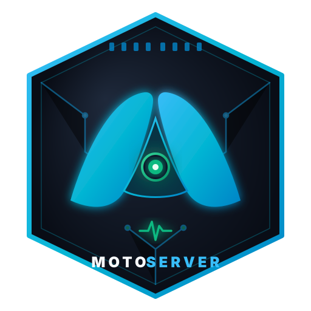
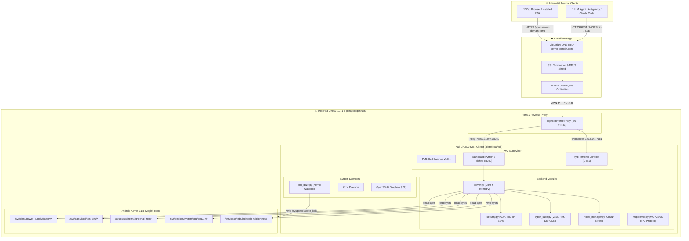

# 📱 Android-MicroServer: Autonomous ARM64 Linux Micro-Server & AI Appliance

<p align="center">
  
</p>

<p align="center">
  <strong>Transform any Android smartphone into an ultra-low-power, 24/7 personal cloud server, hardware telemetry station, and self-hosted AI development environment.</strong>
</p>

<p align="center">
  
  
  
  
  
  
  
  
  
  <a href="llms.txt"></a>
</p>

> 🌐 **Language:** English | [Leer esta documentación en Español](README.es.md)

---

## 📑 Table of Contents

- [1. Project Vision & Philosophy](#1-project-vision--philosophy)
- [2. Key Features](#2-key-features)
- [3. System Architecture](#3-system-architecture)
  - [3.1 Full Topology](#31-full-topology)
  - [3.2 Hardware Specifications (Motorola One XT1941-5)](#32-hardware-specifications-motorola-one-xt1941-5)
- [4. Repository Structure](#4-repository-structure)
- [5. Step-by-Step Installation & Setup Guide](#5-step-by-step-installation--setup-guide)
  - [Step 1: Android Preparation & Root](#step-1-android-preparation--root)
  - [Step 2: Deploying the Kali Linux Chroot](#step-2-deploying-the-kali-linux-chroot)
  - [Step 3: Installing System Dependencies](#step-3-installing-system-dependencies)
  - [Step 4: Installing Backend & Microservices](#step-4-installing-backend--microservices)
  - [Step 5: Nginx & Cloudflare SSL Setup](#step-5-nginx--cloudflare-ssl-setup)
  - [Step 6: PM2 Supervisor Configuration](#step-6-pm2-supervisor-configuration)
  - [Step 7: 24/7 Uptime & Anti-Doze Wakelock](#step-7-247-uptime--anti-doze-wakelock)
- [6. Backend Modules (`server/`)](#6-backend-modules-server)
- [7. Frontend Applications & PWAs (`server/static/`)](#7-frontend-applications--pwas-serverstatic)
  - [7.1 Claude Desktop-Themed AI Agent Interface](#71-claude-desktop-themed-ai-agent-interface)
  - [7.2 Hardware Telemetry Dashboard](#72-hardware-telemetry-dashboard)
- [8. Comprehensive REST API Catalog](#8-comprehensive-rest-api-catalog)
- [9. MCP Server: Autonomous Development Agent (`mcp/`)](#9-mcp-server-autonomous-development-agent-mcp)
  - [9.1 The 8 Specialized MCP Tools](#91-the-8-specialized-mcp-tools)
  - [9.2 Safe Deployment Flow with Auto-Rollback](#92-safe-deployment-flow-with-auto-rollback)
  - [9.3 Setup in Antigravity / Claude Code / Cursor](#93-setup-in-antigravity--claude-code--cursor)
- [10. Cable-Free Client Bridge (`client/remote_bridge.py`)](#10-cable-free-client-bridge-clientremote_bridgepy)
- [11. Antigravity Skill (`skills/`)](#11-antigravity-skill-skills)
- [12. Optimization, Thermals & Battery Health](#12-optimization-thermals--battery-health)
- [13. Porting to Other Android Devices](#13-porting-to-other-android-devices)
- [14. Frequently Asked Questions & Raspberry Pi Comparison (FAQ)](#14-frequently-asked-questions--raspberry-pi-comparison-faq)
- [15. License & Credits](#15-license--credits)

---

## 1. Project Vision & Philosophy

Millions of fully functional smartphones end up forgotten in drawers or landfills every year simply because their software updates ended or their screens got scratched. Yet, an average mid-range smartphone packs formidable hardware:
- An ultra-efficient **multi-core ARM64 processor**.
- Low-power LPDDR RAM.
- Integrated dual-band Wi-Fi and Bluetooth radios.
- **A built-in battery acting as a natural UPS (Uninterruptible Power Supply)**, safeguarding the system from unexpected blackouts with zero data corruption.
- Dozens of hardware sensors (temperature, voltage, current) directly accessible via the Linux `sysfs` tree.

**Android-MicroServer** taps into this potential: it turns a **Motorola One (XT1941-5)** into a high-fidelity personal micro-server drawing **under 5W**, accessible worldwide via custom domain with strict SSL, and governed by an autonomous AI developer agent via the open **Model Context Protocol (MCP)**.

---

## 2. Key Features

- ⚡ **Ultra-Low Power Draw (< 5 Watts):** Less power than a standard LED bulb; designed to run 24/7/365 without impacting your electric bill.
- 🔋 **Built-In UPS / Battery Backup:** The 3000 mAh internal battery keeps the server online during power outages for 6 to 8 continuous hours.
- 🤖 **Embedded AI Agent (Claude Desktop PWA):** Installable progressive web app with Server-Sent Events (SSE) streaming, smart chat title extraction, and individual conversation deletion.
- 📊 **Deep Hardware Telemetry:** Per-second monitoring of Qualcomm Snapdragon cores (8x Cortex-A53), Adreno 506 GPU, battery charging sensors (mA, mV, status, temperature), and thermal zones.
- 🛡️ **Cybersecurity Suite & Encrypted Vault:**
  - Encrypted credential vault (`vault_data/`).
  - File Integrity Monitoring (FIM) with SHA-256 baselines.
  - Threat Hunter and automated brute-force IP bans.
  - Configurable DEFCON modes.
- 📝 **Markdown Notes Manager:** Fast JSON storage with tag support, search, and offline-capable synchronization.
- 💻 **Web Terminal Console (`ttyd`):** In-browser bash terminal protected behind a reverse proxy.
- 🔌 **Autonomous MCP Development Server:** Enables AI assistants (Claude, Antigravity, Cursor) to inspect system architecture, read source code, and **apply code patches with automated PM2 reload** and fault-tolerant rollback.
- 🚫 **Zero Dependency on Cables or ADB:** Once deployed, all administration, development, and maintenance are 100% wireless over LAN/HTTPS.

---

## 3. System Architecture

### 3.1 Full Topology



### 3.2 Hardware Specifications (Motorola One XT1941-5)

| Component | Technical Specification | Linux Driver / sysfs Path |
| :--- | :--- | :--- |
| **Device / Model** | **Motorola One (XT1941-5)** (Codename: `deen`) | Base Android One + Kali Linux aarch64 chroot |
| **SoC** | Qualcomm Snapdragon 625 (MSM8953) | ARM64 v8-A Architecture |
| **CPU** | 8x ARM Cortex-A53 @ 2.016 GHz | `/sys/devices/system/cpu/cpu[0-7]/` |
| **GPU** | Qualcomm Adreno 506 @ 650 MHz | `/sys/class/kgsl/kgsl-3d0/` |
| **RAM** | 4 GB LPDDR3 (3570 MB usable) | `/proc/meminfo` |
| **Swap / zRAM** | 2048 MB swapfile / compressed zRAM | `/proc/swaps` |
| **Storage** | 64 GB eMMC 5.1 + MicroSD slot (51.3 GB mounted) | `/data`, `/sdcard` |
| **Battery** | 3000 mAh Li-ion (Natural UPS) | `/sys/class/power_supply/battery/` |
| **Thermal Sensors**| Independent sensors for CPU, PMIC, and chassis | `/sys/class/thermal/thermal_zone*/` |
| **Physical Torch** | High-power camera flash LED | `/sys/class/leds/led:torch_0/brightness` |
| **Connectivity** | Wi-Fi 802.11 a/b/g/n (2.4 & 5 GHz) + Bluetooth 4.2 | Network interface `wlan0` |

---

## 4. Repository Structure

```text
android-microserver/
├── server/                     # Server backend code (deployed to /root/dashboard)
│   ├── server.py               # Core aiohttp server, router, telemetry & SSE agent bridge
│   ├── security.py             # Auth layer, HTTP-only sessions, PIN validation & IP firewall
│   ├── cyber_suite.py          # Encrypted vault, FIM file integrity checker & DEFCON modes
│   ├── notes_manager.py        # Lightweight JSON notes manager with tag & markdown support
│   ├── anti_doze.py            # Wakelock daemon preventing Android CPU sleep
│   ├── keep_alive.sh           # Emergency watchdog script
│   ├── gdrive_uploader.py      # Automated Google Drive backup module
│   └── static/                 # Static web frontends & Progressive Web Apps (PWAs)
│       ├── agent.html          # Claude Desktop-styled PWA for the AI agent
│       ├── agent-manifest.json # Standalone install manifest for the Agent PWA
│       ├── agent-sw.js         # Service Worker managing Agent PWA caching
│       ├── index.html          # Control dashboard with live hardware telemetry gauges
│       └── ...                 # SVG/PNG icons, CSS, and vendor assets
│
├── client/                     # Utilities to administer the server from any workstation
│   ├── remote_bridge.py        # All-in-one CLI: stats, remote bash execution, file reader
│   └── sync_backup.py          # Two-way backup synchronization over streaming tar.gz
│
├── mcp/                        # "motoserver-dev" Model Context Protocol (MCP) server
│   ├── server.py               # JSON-RPC 2.0 stdio server exposing 8 specialized tools
│   ├── instructions.md         # Automated instruction context for LLM assistants
│   ├── schemas/                # Validated JSON schemas for each MCP tool
│   │   ├── motoserver_get_architecture.json
│   │   ├── motoserver_inspect_component.json
│   │   ├── motoserver_api_catalog.json
│   │   ├── motoserver_server_health.json
│   │   ├── motoserver_feature_blueprint.json
│   │   ├── motoserver_run_remote_command.json
│   │   ├── motoserver_read_remote_file.json
│   │   └── motoserver_apply_patch_and_restart.json
│   └── config/
│       └── mcp_config.example.json # MCP configuration template for Claude / Cursor / Antigravity
│
├── skills/                     # Agent skills catalog
│   └── motoserver-dev/
│       └── SKILL.md            # Skill specification and architectural rules
│
├── Dockerfile                  # Container definition for containerized MCP testing
├── llms.txt                    # Standard LLM discovery and intent metadata
├── LICENSE                     # MIT Open Source License
└── README.md                   # Complete documentation
```

---

## 5. Step-by-Step Installation & Setup Guide

Follow this guide to replicate this autonomous micro-server on your Android device:

### Step 1: Android Preparation & Root
1. **Unlock the Bootloader** of the device (on Motorola via the official Motorola Developer Portal).
2. **Flash Magisk** (v24+) via TWRP or OrangeFox recovery to establish permanent root access (`su`).
3. Enable **USB Debugging** and turn on *"Stay awake while charging"* in Developer Options for initial configuration.

### Step 2: Deploying the Kali Linux Chroot
You can use apps such as **Linux Deploy** or deploy the chroot manually in `/data/local/kali`:
```bash
# Connect to Android shell as root
adb shell
su

# Create directory and prepare rootfs
mkdir -p /data/local/kali
cd /data/local/kali

# Download and unpack Kali Linux ARM64 rootfs
# (or bootstrap via debootstrap from a Linux host)
```

Essential mounts required in the chroot startup script:
```bash
mount -o bind /dev /data/local/kali/dev
mount -t devpts devpts /data/local/kali/dev/pts
mount -t proc proc /data/local/kali/proc
mount -t sysfs sysfs /data/local/kali/sys
mount -o bind /sdcard /data/local/kali/sdcard

# Enter chroot environment
chroot /data/local/kali /bin/bash
```

### Step 3: Installing System Dependencies
Inside the Kali Linux chroot:
```bash
apt update && apt upgrade -y
apt install -y python3 python3-pip python3-venv git curl wget nginx ttyd dropbear build-essential
curl -fsSL https://deb.nodesource.com/setup_20.x | bash -
apt install -y nodejs
npm install -g pm2
```

### Step 4: Installing Backend & Microservices
Clone this repository or copy the `server/` directory into `/root/dashboard`:
```bash
mkdir -p /root/dashboard
cp -r server/* /root/dashboard/
cd /root/dashboard

# Install required Python packages
pip3 install -r requirements.txt
```

### Step 5: Nginx & Cloudflare SSL Setup
Create the Nginx configuration in `/etc/nginx/sites-available/default`:
```nginx
server {
    listen 80;
    server_name your-server-domain.com;
    return 301 https://$host$request_uri;
}

server {
    listen 443 ssl http2;
    server_name your-server-domain.com;

    ssl_certificate /etc/nginx/ssl/cloudflare_origin.crt;
    ssl_certificate_key /etc/nginx/ssl/cloudflare_origin.key;
    ssl_protocols TLSv1.2 TLSv1.3;

    # Core Dashboard & API
    location / {
        proxy_pass http://127.0.0.1:8080;
        proxy_set_header Host $host;
        proxy_set_header X-Real-IP $remote_addr;
        proxy_set_header X-Forwarded-For $proxy_add_x_forwarded_for;
        proxy_set_header X-Forwarded-Proto https;

        # Server-Sent Events (SSE) streaming support
        proxy_set_header Connection '';
        proxy_http_version 1.1;
        chunked_transfer_encoding off;
        proxy_buffering off;
        proxy_cache off;
    }

    # Web Terminal Console (ttyd with WebSockets)
    location /terminal/ {
        proxy_pass http://127.0.0.1:7681/;
        proxy_http_version 1.1;
        proxy_set_header Upgrade $http_upgrade;
        proxy_set_header Connection "upgrade";
        proxy_read_timeout 86400s;
    }
}
```
Reload Nginx: `systemctl restart nginx` or `service nginx restart`.

### Step 6: PM2 Supervisor Configuration
Start services in the background so they automatically recover on crashes:
```bash
cd /root/dashboard

# Start core aiohttp server
pm2 start server.py --name "dashboard" --interpreter python3

# Start web terminal console
pm2 start "ttyd -p 7681 -t fontSize=14 bash" --name "ttyd"

# Save process list for reboots
pm2 save
```

### Step 7: 24/7 Uptime & Anti-Doze Wakelock
To prevent the Android Linux kernel from throttling or suspending the CPU when the screen is dark, run `anti_doze.py` on boot:
```bash
python3 /root/dashboard/anti_doze.py &
```
This daemon writes `motoserver_wakelock` to `/sys/power/wake_lock`, ensuring all 8 cores remain active 24 hours a day.

---

## 6. Backend Modules (`server/`)

### `server.py`
The asynchronous backbone powered by `aiohttp.web`. Key capabilities:
- **`api_stats(request)`:** Reads kernel sysfs metrics directly:
  - Battery: `/sys/class/power_supply/battery/capacity`, `temp`, `voltage_now`, `status`.
  - CPU: Overall utilization and individual load per core across all 8 Cortex-A53 cores, plus active clock speeds (`scaling_cur_freq`).
  - GPU: Current clock frequency and `Adreno506` device status via `/sys/class/kgsl/kgsl-3d0/`.
  - Thermals: Reads `/sys/class/thermal/thermal_zone*` nodes (CPU, PMIC, Chassis).
  - Supervisor state: Real-time health check on PM2 processes (`pm2_dashboard_alive`, `pm2_ttyd_alive`).
- **`api_agent_stream(request)`:** SSE (Server-Sent Events) streaming bridge for LLM prompts, returning real-time markdown deltas and command outputs. Guarded by Bearer token authorization.
- **`api_agent_conversations(request)`:** Scans conversation transcripts (`transcript.jsonl`), extracts user prompts, and automatically titles chat sessions.
- **`api_agent_conversation_delete(request)`:** Deletes specific conversation history folders via UUID.

### `security.py`
Core defensive shielding:
- **Secure Session Cookies:** Tamper-proof session validation using `HttpOnly; SameSite=Lax` cookies.
- **PIN-Protected Admin Operations:** High-privilege endpoints protected by a customizable PIN.
- **Brute-Force Shield:** Logs authentication failures in `security_events.json` and issues IP bans.

### `cyber_suite.py`
Advanced defensive features:
- **Encrypted Vault (`vault_data/`):** AES-256-GCM encrypted credential store derived from master password.
- **File Integrity Monitoring (FIM):** Continuously verifies critical system scripts against SHA-256 baseline hashes (`fim_baseline.json`).
- **DEFCON Levels:** Fast-switch defensive lockdown modes.

### `notes_manager.py`
Lightweight task and documentation manager:
- High-speed JSON storage in `notes_data.json`.
- Full-text search and tag filtering.
- Safe archive and restore features.

---

## 7. Frontend Applications & PWAs (`server/static/`)

All user interfaces are built as standalone **Progressive Web Apps (PWAs)** with dedicated `manifest.json` and Service Workers, allowing installation on Android, iOS, Windows, and macOS home screens.

### 7.1 Claude Desktop-Themed AI Agent Interface (`agent.html`)

Designed following the visual identity of **Claude Desktop**:

```
┌────────────────────────────────────────────────────────────────────────┐
│ [≡] New Conversation                            🗑 Delete Chat        │
├──────────────┬─────────────────────────────────────────────────────────┤
│ Conversation │                                                         │
│ History      │   User:                                                 │
│              │   What is the status of the Snapdragon 625?             │
│ • Optimize   │                                                         │
│ • Diagnostic │   Antigravity Agent:                                    │
│ • PM2 Logs   │   The Qualcomm Snapdragon 625 is currently at           │
│              │   34.2 °C with a 14.5% average load across 8 cores...   │
│              │                                                         │
│              │   ```bash                                               │
│              │   pm2 status dashboard                                  │
│              │   ```                                                   │
│              │                                                         │
│ 🗑 Delete    │  ┌──────────────────────────────────────────────┐ [➤]   │
│              │  │ Type your prompt here...                     │       │
│└─────────────┴──┴──────────────────────────────────────────────┴───────┘
```

#### Visual Design Tokens:
- **Background:** `#1b1917` (Deep Stone Black).
- **Sidebar:** `#262422` (Warm Charcoal).
- **Accent Color:** `#b55d3e` (Terracotta Clay).
- **Cards & Surfaces:** `#35322e` with subtle `#3e3c38` borders.
- **Typography:** Neutral high-contrast text `#ececec` with `#9c9790` secondary labels.

#### Key Features:
1. **Smart Title Extraction:** Automatically labels conversation items based on initial user prompts.
2. **Individual Chat Deletion:** Each chat includes a delete action (`🗑`) with an animated confirmation modal and `Esc` key dismiss.
3. **Smooth Auto-Scroll:** Utilizes a `MutationObserver` to autoscroll during streaming, pausing automatically if the user scrolls up.
4. **Code Copying:** Interactive copy button on code blocks with visual feedback.

### 7.2 Hardware Telemetry Dashboard (`index.html`)
- Real-time speedometer gauges for:
  - Battery capacity (%) and charging state (Discharging, Charging, Full).
  - Battery and CPU core temperatures.
  - RAM and Swap memory utilization.
- Interactive toggle for physical camera LED flashlight.
- Dynamic bar chart for all 8 CPU core frequencies.

---

## 8. Comprehensive REST API Catalog

### ⚙ System & Hardware Telemetry
| Endpoint | Method | Auth | Parameters / Body | Response |
| :--- | :---: | :---: | :--- | :--- |
| `/api/stats` | `GET` | No | None | JSON with live telemetry (CPU, GPU, RAM, thermals, PM2, battery). |
| `/api/system/info` | `GET` | No | None | Static hardware specifications, kernel release, and uptime. |
| `/api/actions/flashlight` | `POST` | Yes | `{"state": true/false}` | Toggles the phone's physical LED torch. |
| `/api/actions/restart` | `POST` | Yes | `{"service": "dashboard"}` | Restarts specified PM2 service. |

### 🤖 AI Agent & Automation
| Endpoint | Method | Auth | Parameters / Body | Response |
| :--- | :---: | :---: | :--- | :--- |
| `/api/agent/stream` | `POST` | Bearer Token | `{"prompt": "...", "conversation_id": "...", "workspace": "..."}` | SSE event stream (`data: {"event": ...}`) with real-time text. |
| `/api/agent/conversations` | `GET` | No | None | Chronological list of chats with `id`, `title`, and timestamps. |
| `/api/agent/conversation/{id}` | `GET` | No | Path UUID | Complete message history of requested conversation. |
| `/api/agent/conversation/{id}` | `DELETE`| No | Path UUID | `{"success": true, "deleted": "..."}` after removing chat files. |
| `/api/agent/conversation/{id}/delete` | `POST` | No | Path UUID | Alternative POST route for deleting conversations. |

### 📁 File Manager
| Endpoint | Method | Auth | Parameters / Body | Response |
| :--- | :---: | :---: | :--- | :--- |
| `/api/files/list` | `GET` | Yes | `?path=/root/dashboard` | Lists files and folders with size and permissions. |
| `/api/files/content` | `GET` | Yes | `?path=/path/to/file` | Raw text content of requested file. |
| `/api/files/save-content` | `POST` | Yes | `{"path": "...", "content": "..."}` | Writes updated content to target file. |
| `/api/files/upload` | `POST` | Yes | Multipart Form-Data | Uploads binary or compressed files to server. |

### 📝 Notes & Tasks
| Endpoint | Method | Auth | Parameters / Body | Response |
| :--- | :---: | :---: | :--- | :--- |
| `/api/notes/list` | `GET` | No | None | List of all active saved notes. |
| `/api/notes/save` | `POST` | No | `{"id": "...", "title": "...", "content": "...", "tags": [...]}` | Creates or updates a note. |
| `/api/notes/delete` | `POST` | No | `{"id": "..."}` | Deletes specified note. |
| `/api/notes/toggle-done` | `POST` | No | `{"id": "...", "done": true}` | Toggles task completion state. |

### 🛡 Cybersecurity & Vault
| Endpoint | Method | Auth | Parameters / Body | Response |
| :--- | :---: | :---: | :--- | :--- |
| `/api/security/dashboard` | `GET` | Yes | None | Overview of banned IPs and active sessions. |
| `/api/security/vault/list`| `GET` | Yes | None | List of stored credential keys in vault. |
| `/api/security/vault/save`| `POST` | Yes | `{"id": "...", "secret": "..."}` | Stores encrypted secret using master password. |
| `/api/security/defcon` | `POST` | Yes | `{"level": 1-5}` | Sets server defensive posture level. |

---

## 9. MCP Server: Autonomous Development Agent (`mcp/`)

The **Model Context Protocol (MCP)** is an open standard developed by Anthropic connecting AI models with local tools and development environments.

This repository includes a native MCP server (`mcp/server.py`) implementing the **JSON-RPC 2.0 stdio** specification. It is written using Python's standard library with zero external dependencies.

### 9.1 The 8 Specialized MCP Tools

| Tool | Parameters | Action Description |
| :--- | :--- | :--- |
| `motoserver_get_architecture` | `layer` *(optional)* | Returns the complete system map in JSON (Hardware, Kernel, Network, PM2, Backend, Frontend). |
| `motoserver_inspect_component`| `component` *(required)* | Deep-dive inspection of core components: `'server_core'`, `'pwa_agent'`, `'telemetry_sensors'`, `'cyber_suite'`, etc. |
| `motoserver_api_catalog` | `category` *(optional)* | Returns REST API specifications with signatures and expected payloads. |
| `motoserver_server_health` | `detailed` *(optional)* | Queries live `/api/stats` and returns CPU temps, battery status, and PM2 health. |
| `motoserver_feature_blueprint`| `feature_title`, `target_components` | Generates architectural blueprints adapted to the thermal and RAM constraints of the Snapdragon 625. |
| `motoserver_read_remote_file` | `file_path`, `start_line`, `max_lines` | Reads exact lines from remote files without downloading the full codebase. |
| `motoserver_run_remote_command` | `command`, `timeout_seconds` | Runs remote bash commands inside the Kali Linux chroot with timeout protection. |
| `motoserver_apply_patch_and_restart` | `target_file`, `patch_type`, `search_content`, `replacement_content`, `restart_service` | **Applies code patches with automated backups, python syntax checks, and PM2 service reloads.** |

### 9.2 Safe Deployment Flow with Auto-Rollback

To prevent code patches from rendering the micro-server inaccessible, `motoserver_apply_patch_and_restart` follows a strict protocol:

```
                       [Patch Initiated]
                               │
                               ▼
               1. Timestamped Backup Created (.bak.<ts>)
                               │
                               ▼
             2. Safe String Injection (Base64 Safe)
                               │
                               ▼
                    Is target a Python file (.py)?
                     ├── YES ──► 3. Run 'python3 -m py_compile'
                     │              │
                     │              ├── Syntax Error Detected?
                     │              │      │
                     │              │      ▼
                     │              │   [IMMEDIATE ROLLBACK]
                     │              │   - Restore target from .bak
                     │              │   - Cancel PM2 reload
                     │              │   - Return exact Traceback to LLM
                     │              │
                     │              └── Syntax Valid ──┐
                     └── NO ───────────────────────────┤
                                                       ▼
                                         4. Run 'pm2 restart <service>'
                                                       │
                                                       ▼
                                         5. Verify Health at /api/stats
                                                       │
                                                       ▼
                                              [Deployment Successful]
```

### 9.3 Setup in Antigravity / Claude Code / Cursor

To connect your local AI development environment to the micro-server, add the following configuration to your MCP config file (e.g. `~/.gemini/config/mcp_config.json` or Cursor / Claude Desktop settings):

```json
{
  "mcpServers": {
    "android-microserver-dev": {
      "command": "python",
      "args": [
        "/absolute/path/to/android-microserver/mcp/server.py"
      ],
      "env": {
        "PYTHONIOENCODING": "utf-8",
        "MOTOSERVER_HOST": "https://your-server-domain.com",
        "MOTOSERVER_AGENT_KEY": "YOUR_AGENT_API_KEY"
      }
    }
  }
}
```

---

## 10. Cable-Free Client Bridge (`client/remote_bridge.py`)

No USB cables or ADB connections are required once the server is deployed. The [`client/remote_bridge.py`](client/remote_bridge.py) CLI allows complete administration over LAN or HTTPS:

### Example Usage:

```bash
# 1. Check live uptime, battery, and CPU thermals:
python client/remote_bridge.py stats

# 2. Inspect raw, detailed hardware metrics:
python client/remote_bridge.py stats --detailed

# 3. Execute remote bash commands inside Kali Linux chroot:
python client/remote_bridge.py exec "free -h && df -h"
python client/remote_bridge.py exec "pm2 list"

# 4. Read remote code files (e.g. lines 1 to 40 of server.py):
python client/remote_bridge.py read /root/dashboard/server.py --start 1 --lines 40

# 5. Restart a PM2 microservice remotely:
python client/remote_bridge.py restart dashboard
```

### Automatic Backup Synchronization (`client/sync_backup.py`):
Need to pull an updated snapshot of the server to your local workstation?
```bash
python client/sync_backup.py
```
This utility streams a `.tar.gz` snapshot from the phone directly to your computer over HTTP in under 10 seconds, updating your local `server/` directory.

---

## 11. Antigravity Skill (`skills/`)

Located at [`skills/motoserver-dev/SKILL.md`](skills/motoserver-dev/SKILL.md), this skill instructs AI agents on architectural best practices:
- **Never block the event loop:** Offload CPU-heavy operations using `loop.run_in_executor()`.
- **Anti-Slop Visual Guidelines:** Preserve the Claude Desktop color scheme when modifying frontends; avoid generic corporate gradients.
- **Cache Invalidation:** Always bump the cache key in `agent-sw.js` when modifying frontend assets.

---

## 12. Optimization, Thermals & Battery Health

Running a smartphone 24/7 plugged into a charger requires proper precautions to preserve hardware longevity:

1. **Thermal Optimization:**
   - Normal operating temperature ranges between **30 °C and 36 °C**.
   - Keep the phone upright or on a stand allowing passive heat dissipation from the rear chassis.
   - If internal temperatures exceed **45 °C**, Android kernel thermal throttling will slow down CPU cores. The `/api/stats` endpoint actively monitors this threshold.
2. **Battery Care & Swelling Prevention:**
   - To prevent chemical battery stress caused by sitting at 100% capacity continuously, install the **ACC (Advanced Charging Controller)** Magisk module:
     ```bash
     acc 75 70  # Stop charging at 75%, resume when dropping below 70%
     ```
   - This keeps the battery in its lowest chemical degradation window, operating as a permanent UPS without battery swelling.

---

## 13. Porting to Other Android Devices

While optimized for the Qualcomm Snapdragon 625 (MSM8953), this architecture is modular and easily adapted to any ARM64 Android device (Snapdragon, MediaTek Helio/Dimensity, Samsung Exynos, Google Tensor):

| Subsystem | Qualcomm Snapdragon Path | Common MediaTek / Exynos Path |
| :--- | :--- | :--- |
| **Battery** | `/sys/class/power_supply/battery/` | `/sys/class/power_supply/battery/` |
| **GPU** | `/sys/class/kgsl/kgsl-3d0/` | `/sys/class/mali/` or `/sys/kernel/gpu/` |
| **CPU Frequency** | `/sys/devices/system/cpu/cpu*/cpufreq/` | `/sys/devices/system/cpu/cpu*/cpufreq/` |
| **Thermal Zones** | `/sys/class/thermal/thermal_zone*/` | `/sys/class/thermal/thermal_zone*/` |
| **Torch LED** | `/sys/class/leds/led:torch_0/brightness` | `/sys/class/leds/torch-light/brightness` |

To port to other devices, simply update the path variables in `api_stats` inside `server/server.py`.

---

## 14. Frequently Asked Questions & Raspberry Pi Comparison (FAQ)

### ❓ Why repurpose an old Android phone instead of buying a Raspberry Pi?

| Feature | 📱 Android Smartphone (Android-MicroServer) | 🍓 Raspberry Pi 4 / 5 |
| :--- | :--- | :--- |
| **Initial Cost** | **$0 USD** (Recycled / Existing hardware) | $60 - $120 USD (Board + PSU + Case + MicroSD) |
| **Built-in UPS Against Outages** | **Integrated out of the box** (3000-5000 mAh battery = 6-8h uptime) | Requires external UPS HAT or battery pack ($30-$50 USD) |
| **Data Corruption Risk** | **Minimal:** Onboard eMMC/UFS backed by battery buffer | **High:** MicroSD cards frequently corrupt during blackouts |
| **Wireless Connectivity** | Dual-Band Wi-Fi, Bluetooth, plus optional 4G LTE cellular failover | Wi-Fi / Bluetooth only |
| **Telemetry Display** | Built-in touchscreen for gauges and console output | Requires external HDMI display or display HAT |
| **Average Power Draw** | **< 3 to 5 Watts** (Ultra-efficient smartphone SoC) | 5 to 12 Watts under load |

### 🤖 How do AI coding assistants interact with this server?
The project implements the official **Model Context Protocol (MCP)** in `mcp/server.py`. When connected to Claude Desktop, Cursor, or Antigravity, the assistant gains direct tools to:
1. Query deep hardware telemetry without SSH overhead.
2. Read remote code files with pagination.
3. Propose code patches, validate syntax, and reload PM2 services with automated rollback on failure.

### 🛡️ Is it safe to expose this server to the public Internet?
Yes. It uses a **defense-in-depth** security model:
1. **No exposed router ports:** Uses Cloudflare Tunnels or strict reverse proxy SSL termination.
2. **Bearer Authentication:** Command execution endpoints (`/api/agent/stream`) return `HTTP 401 Unauthorized` without valid authentication.
3. **Active Host Defense:** Includes automated file integrity monitoring (`cyber_suite.py`) and IP banning against brute-force attacks.

### 🔍 Recommended Use Cases
- **Ultra-Efficient Homelab Node:** Host lightweight microservices, Telegram/Discord bots, cron jobs, and home automations.
- **IoT & Edge Telemetry Station:** Remote monitoring appliance with continuous battery resilience.
- **Autonomous AI Testing Ground:** Sandbox environment where AI assistants can deploy and test services safely.
- **Self-Hosted Markdown Notes Vault:** Encrypted personal documentation and task tracking.

---

## 15. License & Credits

- **License:** Distributed under the **[MIT License](LICENSE)**. Open-source and free for personal, educational, and commercial use.
- **LLM Discovery:** Adheres to the **[llms.txt](llms.txt)** standard for generative engine search.
- **Author & Developer:** [Richpol99](https://github.com/Richpol99)
- **Ecosystem:** Built with open-source tools: Linux, Python aiohttp, PM2, Nginx, Kali Linux, and the Model Context Protocol (MCP).

---

<p align="center">
  <sub>Built with care to breathe second life into hardware and democratize autonomous edge computing.</sub>
</p>
